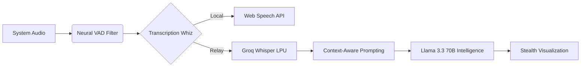

# ZEDX-AI: Professional Intelligence Systems

[Live Platform](https://zedx-ai-assistant-1.vercel.app) | [Desktop Console](https://github.com/ziademad02153/ZEDX-AI-Assistant/releases/latest)

ZEDX-AI is an specialized AI Intelligence System designed for real-time interview augmentation. By integrating advanced neural processing with a low-level system overlay, ZEDX-AI provides untraceable, high-fidelity guidance for professional career advancement.

---

## Technical Architecture

ZEDX-AI operates on a hybrid infrastructure, balancing client-side responsiveness with cloud-scale intelligence.

### Neural Processing Pipeline

### Infrastructure Components

| Layer | Technology | Function |
| :--- | :--- | :--- |
| Core Framework | Next.js 16 (Turbopack) | High-performance reactive web architecture. |
| Desktop Runtime | Electron 39 | Low-level OS integration and hardware access. |
| AI Inference | Groq LPU (5-Key Scaling) | Sub-500ms response latency for complex queries. |
| Data Security | Supabase PostgreSQL | Military-grade RLS (Row Level Security) encryption. |
| Audio Intelligence | Neural VAD (Voice Activity) | Precision filtering of background digital noise. |

---

## Core System Capabilities

### Untraceable Stealth Overlay
The ZEDX-AI Desktop Console utilizes a custom windowing strategy that ensures the intelligence overlay remains invisible to all screen-sharing and monitoring software.
- High-Performance Transparency: Zero GPU overhead during active sessions.
- System Integration: Direct hardware-level listeners for interviewer audio capture.

### Hybrid STT Scaling (ZEDX-Whiz)
Transcription is handled by a sophisticated logic-gate system that optimizes for both cost and accuracy.
- Browser Instance: Utilizes native Web Speech API for zero-cost, localized processing.
- Desktop Instance: Utilizes a 5-key round-robin Groq Whisper relay to bypass rate limits and maintain high-fidelity verbal capture.

### Contextual Memory Engine
The AI does not operate in a vacuum. It ingests and correlates multiple data points to provide precise guidance:
- Professional Resumes: Parsed and indexed in real-time.
- Job Specifications: Semantic matching between user skills and career requirements.

---

## Deployment & Implementation

### Prerequisites
- Windows 10/11 Architecture
- Node.js 18 (LTS) for development
- Active Supabase Project for persistent state management

### Native Installation
1. Binary Execution: Download the latest ZEDX Setup EXE from the official repository.
2. Secure Authentication: Sign in via the encrypted Supabase Auth gateway.
3. Intelligence Activation: Initialize the Console and toggle the Stealth Overlay (Alt+Space).

---

Developed by Ziad Emad.
Focused on Technical Excellence and Privacy-First Design.
